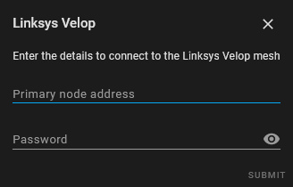
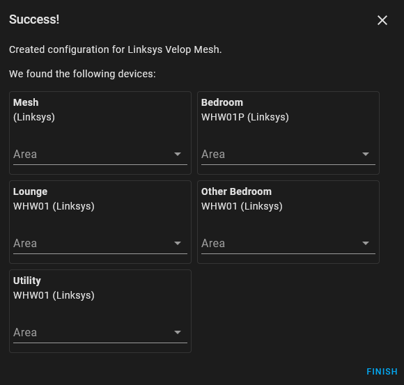
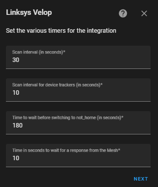
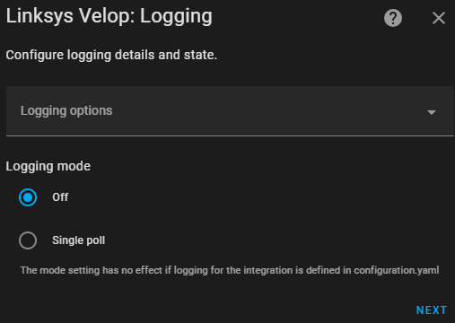
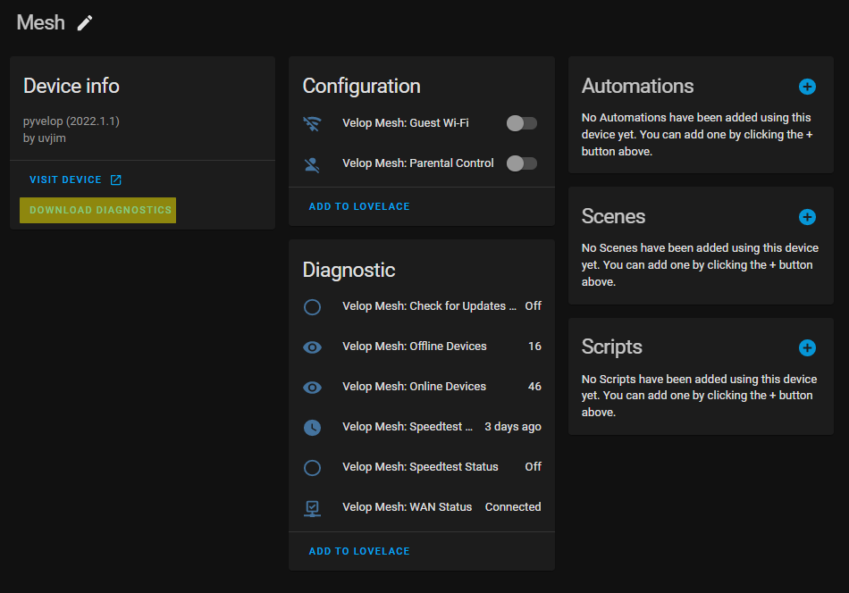
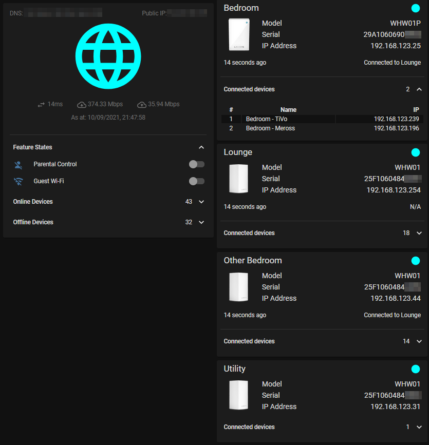
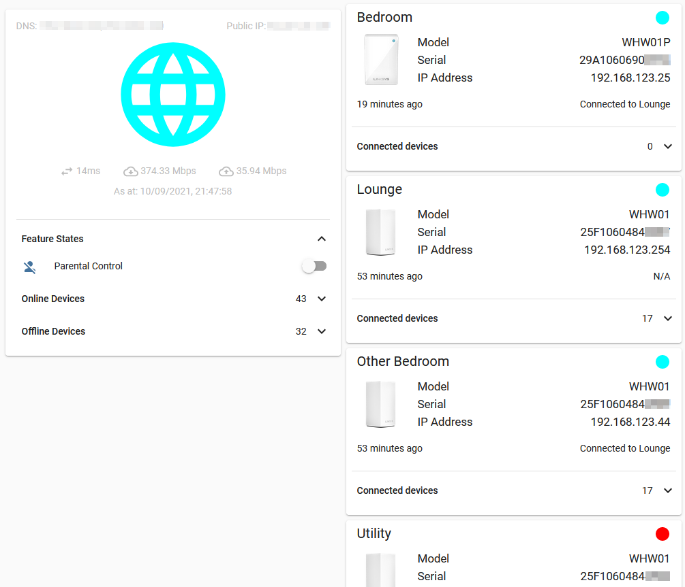
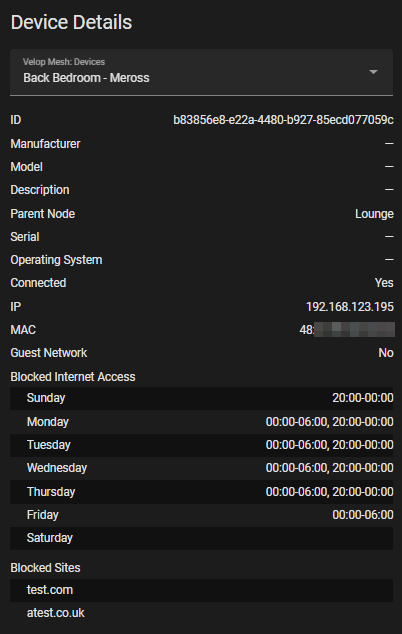
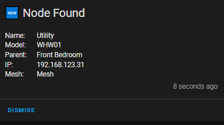

# Linksys Velop

Home Assistant integration for the Linksys Velop Wi-Fi system.

## Table of Contents
* [Description](#description)
  * [Definitions](#definitions)
  * [Entities Provided](#entities-provided)
    * [Binary Sensors](#binary-sensors)
    * [Buttons](#buttons)
    * [Device Trackers](#device-trackers)
    * [Select](#select)
    * [Sensors](#sensors)
    * [Switches](#switches)
    * [Update](#update-only-if-hass--202240)
  * [Events Fired](#events-fired)
    * [linksys_velop_new_device_on_mesh](#linksys_velop_new_device_on_mesh)
    * [linksys_velop_new_node_on_mesh](#linksys_velop_new_node_on_mesh)
    * [linksys_velop_new_primary_node](#linksys_velop_new_primary_node)
  * [Services](#services)
* [Setup](#setup)
* [Configurable Options](#configurable-options)
  * [Timers](#timers)
  * [Device Trackers](#device-trackers-1)
  * [Logging](#logging)
* [Advanced Options](#advanced-options)
* [Troubleshooting](#troubleshooting)
  * [Debug Logging](#debug-logging)
  * [Diagnostics Integration](#diagnostics-integration)
* [Example Lovelace UI](#example-lovelace-ui)
  * [Main UI](#main-ui)
    * [Card 1](#card-1)
    * [Card 2](#card-2)
    * [Card 3](#card-3)
  * [Using the Select Entity](#using-the-select-entity)
* [Example Automations](#example-automations)

## Description

This custom component has been designed to for Home Assistant and enables
access to the functions that would be useful in the Home Assistant environment.

### Definitions

- _Mesh_: the mesh is the network itself and refers to anything that is not
  attributed to a single node or device in  the network.
- _Node_: a node is a device that helps to form the mesh.
- _Device_: a device is an endpoint that connects to the mesh network. Think
  of these as the endpoint devices, such as a laptop, phone or tablet.

### Entities Provided
Where applicable the sub-items in the list detail the additional attributes
available.

#### Binary Sensors

- Mesh: Speedtest state
  - current stage of the Speedtest, e.g. Detecting server, Checking latency
- Mesh: WAN Status
  - IP, DNS, MAC
- Node: Status
  - IP, MAC, guest network
- Node: Update Available (only if HASS < 2022.4.0)

#### Buttons

- Mesh: Check for Updates
- Node: Reboot

#### Device Trackers

These are selectable and are presented as part of the configuration at both
install time and from reconfiguring the integration.

#### Select

- Mesh: Devices *(disabled by default)*
  - Once a device is selected the attributes will be updated to reflect the
    following: connected adapters, description, manufacturer, model, name,
    operating_system, parent name, serial, status and unique_id

#### Sensors

- Mesh: Number of Offline Devices
  - list of device objects containing names and unique ID of devices that are
    offline
- Mesh: Number of Online Devices
  - list of device objects containing names, unique IDs, IP addresses, adapter
    types and guest network state for the online devices
- Mesh: Number of Guest Devices *(disabled by default)*
  - list of device names, IP addresses, adapter types etc
- Mesh: Date of Latest Speedtest
  - Exit code, Latency, Download/Upload bandwidth, Result ID
- Mesh: Number of Available Storage Partitions *(disabled by default)*
  - list of the available partitions including the following information: IP,
    label, available Kb, used Kb, used %age and last checked time
- Node: Number of Connected Devices
  - list of names, IP addresses, type of connection and guest network state for
    the connected devices
- Node: Backhaul (RSSI value in dBm)
  - backhaul information (connection type, speed in Mbps, last checked time and textual representation of RSSI)
- Node: Current Firmware Version (only if HASS < 2022.4.0)
- Node: Last Update Check *(disabled by default)*
- Node: Model Number
- Node: Newest Firmware Version (only if HASS < 2022.4.0)
- Node: Parent Name
  - IP address of the parent
- Node: Serial Number
- Node: Type of Node, e.g. Primary Secondary

#### Switches

- Mesh: Guest Wi-Fi state
  - list of guest networks available
- Mesh: Parental Control state
  - list of the rules being applied

#### Update (only if HASS > 2022.4.0)

- Node: Firmware update available.
  - includes current and latest firmware versions

### Events Fired

#### `linksys_velop_logging_stopped`

This event is fired when logging was turned on in the configurable options
(see [here](#logging)) and has stopped.

The event looks as follows: -

```json
event_type: linksys_velop_logging_stopped
data:
  name: 192.168.1.254
origin: LOCAL
time_fired: "2022-09-03T16:42:40.065730+00:00"
context:
  id: 01GC23Q821F2BRE6XXKZEY6RP7
  parent_id: null
  user_id: null
```

#### `linksys_velop_new_device_on_mesh`

This event is fired when a brand-new device appears on the Mesh. A device is
considered new if it presents a device ID (determined by the Velop) that was
not seen at the last poll period. This means that it will not fire for
devices that change from online to offline and vice-versa.

The event is fired for each new device that is discovered. The data is as
the Velop mesh sees it, i.e. there is no magic by the integration to
establish the manufacturer, model, operating system or serial.

> **N.B.** The name will default to `Network Device` if there is no name
established by the Velop or assigned by the user.

The event looks as follows: -

```json
{
    "event_type": "linksys_velop_new_device_on_mesh",
    "data": {
        "connected_adapters": [
            {
                "mac": "11:22:33:44:55:66",
                "ip": "192.168.1.45",
                "guest_network": false
            }
        ],
        "description": null,
        "manufacturer": null,
        "model": null,
        "name": "Network Device",
        "operating_system": null,
        "parent_name": "Test Parent",
        "serial": null,
        "status": true,
        "mesh_device_id": "04e9bfe6c39d52f8272de96cbf85909c"
    },
    "origin": "LOCAL",
    "time_fired": "2022-03-27T13:43:48.335952+00:00",
    "context": {
        "id": "0bcafe321fc4919958c350da1aaef6de",
        "parent_id": null,
        "user_id": null
    }
}
```

#### `linksys_velop_new_node_on_mesh`

This event is fired when a new node is found on the Mesh. A node is
considered new if it is not currently configured in HASS. It may not be
configured for a couple of reasons: the device was deleted from the UI, or
you've added a new node to your Mesh.

The event is fired for each new node that is discovered.

The event looks as follows: -

```json
{
    "event_type": "linksys_velop_new_node_on_mesh",
    "data": {
        "backhaul": {
            "connection": "Wireless",
            "last_checked": "2022-04-14T12:11:23Z",
            "speed_mbps": 115.037
        },
        "connected_adapters": [
            {
                "mac": "11:22:33:44:55:66",
                "ip": "192.168.123.31",
                "guest_network": false
            }
        ],
        "model": "WHW01",
        "name": "Utility",
        "parent_name": "Front Bedroom",
        "serial": "1234567890",
        "status": true,
        "mesh_device_id": "1ca89cc86d79dff3f3bf91cfc5f6973f"
    },
    "origin": "LOCAL",
    "time_fired": "2022-04-14T12:15:10.150604+00:00",
    "context": {
        "id": "7510f408cfc36511b0c6372542fbfdc0",
        "parent_id": null,
        "user_id": null
    }
}
```

#### `linksys_velop_new_primary_node`

This event is fired when a new primary node is detected. The check for this
is based on the serial number and is currently only found as part of SSDP
discovery. If the serial numbers do not match, this event is fired and the
unique_id of the integration instance is update.

This should stop the mesh being discovered again by SSDP when the primary
node is changed.

```json
{
    "event_type": "linksys_velop_new_primary_node",
    "data": {
        "host": "192.168.123.254",
        "model": "velop ax4200 wifi 6 system",
        "serial": "1234567890"
    },
    "origin": "LOCAL",
    "time_fired": "2022-04-13T12:29:28.749528+00:00",
    "context": {
        "id": "d0cb4b018867b3311f2edb24e156d541",
        "parent_id": null,
        "user_id": null
    }
}
```

### Services

The following services are available.  Each service is described in metadata
so paramters are described in the Home Assistant Services page.

- Check for Updates
- Delete Device
- Execute Speedtest &ast;
- Reboot Node

> &ast; these are considered long-running tasks. When the binary sensors spot
  these tasks are running an additional timer is set up that polls every
  second to get updates and updates the relevant attributes for that sensor.

## Setup

When setting up the integration you will be asked for the following information.



- `Primary node address`: must be the node classed as the primary node
- `Password`: the password you would use to log in to the router. This may
  not be the same as the password for the application or web UI if you use
  the Linksys cloud service.

On successful set up the following screen will be seen detailing the Mesh
device and the individual nodes found in the mesh.



## Configurable Options

It is possible to configure the following options for the integration.

### Timers



- `Scan Interval`: the frequency of updates for the sensors, default `30s`
- `Device Tracker Interval`: the frequency of updates for the device
  trackers, default `10s`
- `Consider Home Period`: the time to wait before considering a device away
  after it notifies of becoming disconnected, default `180s`
- `Response Timeout`: the number of seconds to wait for a response from
  an individual request to the API

### Device Trackers


- `Available devices`: a multi-select list of the devices found on the mesh.
  This list excludes any device which doesn't have a name - typically
  displayed in the official interfaces as `Network Device`

### Logging



- `Include the serial number in debug logs`: setting this will make the serial number of the primary node appear in the debug logs. This will be useful if there a multiple instances of the integration configured. _(defaults to off)_
- `Logging mode` - this setting has no effect if logging for the integration is configured in `configuration.yaml`
  - `off`: disable debug logging
  - `Single poll`: only enable debug logging for a single poll requesting information from the Mesh.

## Advanced Options

This section details the options that cannot be configured in the UI but are
still available of you configure them in the underlying HASS config files.

* `node_images`: the path to the folder location containing the images to
  use for nodes. This is currently used in the card and also for the
  `update` entity, e.g. `/local/velop_nodes` _(the default)_.  This relies on the `http` integration from HASS, details of which can be found [here](https://www.home-assistant.io/integrations/http), and more specifically [here](https://www.home-assistant.io/integrations/http#hosting-files) for the path to place the files in.

## Troubleshooting

### Debug Logging

> This way of logging is most useful if there is an intermitent problem as it will continue logging until it is disabled again.
If your intention is only to log a single request because the issue is repeatable then see [here](#logging).

Debug logging can be enabled in Home Assistant using the `logger`
integration see [here](https://www.home-assistant.io/integrations/logger/).

```yaml
logger:
  default: warning
  logs:
    custom_components.linksys_velop: debug
    pyvelop: debug
```

### Diagnostics Integration

Starting with Home Assistant 2022.2 a new diagnostics integration can be
used to provide troubleshooting for integrations. This integration supports that as of version `2021.1.3`.

The highlighted area in the image below shows where the link for downloading diagnostics can be found.



Example output: -

* [Device](examples/device_diagnostics.json)
* [Configuration Entry and Mesh](examples/config_entry_and_mesh_diagnostics.json)

# Example Lovelace UI

## Main UI

| Dark Mode | Light Mode |
|:---:|:---:|
|  |  |

*Some items of detail have been pixelated for privacy purposes.*

The view consists of 3 main cards.  These are detailed below.

### Card 1

This card is used mainly to work around a limitation in Button Card documented
[here](https://github.com/custom-cards/button-card#injecting-css-with-extra_styles).

#### Pre-requisites

The following custom cards are required for this part of the view.

- [Button Card](https://github.com/custom-cards/button-card)
- [card-mod](https://github.com/thomasloven/lovelace-card-mod)

<details>
  <summary>YAML for the card</summary>

```yaml
type: custom:button-card
color_type: blank-card
card_mod:
  style: |
    :host { display: none !important; }
```
</details>

### Card 2

This card creates the Mesh part of the view.

#### Pre-requisites

- [Button Card](https://github.com/custom-cards/button-card)
- [card-mod](https://github.com/thomasloven/lovelace-card-mod)
- [fold-entity-row](https://github.com/thomasloven/lovelace-fold-entity-row)
- [hui-element](https://github.com/thomasloven/lovelace-hui-element)
- [template-entity-row](https://github.com/thomasloven/lovelace-template-entity-row)

<details>
  <summary>YAML for the card</summary>

```yaml
type: custom:auto-entities
card:
  type: vertical-stack
card_param: cards
filter:
  include:
    - entity_id: /binary_sensor.(velop_)*mesh_wan_status/
      options:
        type: entities
        card_mod:
          style:
            .: |
              #states { padding-top: 0px; }
            fold-entity-row:
              $:
                template-entity-row:
                  $: |
                    state-badge { display: none; }
                    state-badge + div { margin-left: 8px !important; }
                    .info.pointer { font-weight: 500; }
                    .state { margin-right: 10px; }
        entities:
          - type: custom:button-card
            entity: this.entity_id
            show_name: false
            icon: hass:web
            tap_action:
              action: none
            custom_fields:
              attr_dns_servers: '[[[ return (entity != undefined) ? entity.attributes.dns : ""]]]'
              attr_public_ip: '[[[ return (entity != undefined) ? entity.attributes.ip : "" ]]]'
              attr_speedtest_latest: |
                [[[
                  let entity_speedtest_id = 'sensor.' + this._config.entity.split('.')[1].split('_').slice(0, -2).join('_') + '_speedtest_latest'
                  let entity_speedtest = states[entity_speedtest_id]
                  if (entity_speedtest != undefined && entity_speedtest.state != 'unknown') {
                    let d = new Date(entity_speedtest.state)
                    return "As at: " + d.toLocaleString()
                  } else {
                    return "No Speedtest results"
                  }
                ]]]
              attr_speedtest_details: |
                [[[
                  let round2 = (num) => Math.round(num * 100) / 100
                  let spacing_internal = 5
                  let spacing_external = 30
                  let icon_size = 22
                  let entity_speedtest_id = 'sensor.' + this._config.entity.split('.')[1].split('_').slice(0, -2).join('_') + '_speedtest_latest'
                  let entity_speedtest = states[entity_speedtest_id]
                  if (entity_speedtest != undefined && entity_speedtest.state != 'unknown') {
                    let latency = entity_speedtest.attributes.latency
                    let download_bandwidth = round2(entity_speedtest.attributes.download_bandwidth / 1000)
                    let upload_bandwidth = round2(entity_speedtest.attributes.upload_bandwidth / 1000)

                    return `<span style="margin-right: ${spacing_external}px;">
                              <ha-icon icon="hass:swap-horizontal" style="width: ${icon_size}px;"></ha-icon>
                              <span>${latency}ms</span>
                            </span>
                            <span style="margin-right: ${spacing_external}px;">
                              <ha-icon icon="hass:cloud-download-outline" style="width: ${icon_size}px;"></ha-icon>
                              <span>${download_bandwidth} Mbps</span>
                            </span>
                            <span>
                              <ha-icon icon="hass:cloud-upload-outline" style="width: ${icon_size}px;"></ha-icon>
                              <span>${upload_bandwidth} Mbps</span>
                            </span>
                            `
                  }
                ]]]
            state:
              - value: 'on'
                color: darkcyan
              - value: 'off'
                color: darkred
            styles:
              card:
                - box-shadow: none
                - padding: 16px 8px
              grid:
                - grid-template-areas: >-
                    "attr_dns_servers . attr_public_ip" "i i i"
                    "attr_speedtest_details attr_speedtest_details
                    attr_speedtest_details" "attr_speedtest_latest
                    attr_speedtest_latest attr_speedtest_latest"
                - grid-template-rows: 5% 1fr 15% 5%
                - grid-template-columns: 1fr min-content 1fr
              custom_fields:
                attr_dns_servers:
                  - justify-self: self-start
                attr_public_ip:
                  - justify-self: self-end
            extra_styles: >
              div[id^="attr_"] { font-size: smaller; color:
              var(--disabled-text-color);

              }

              div[id^="attr_speedtest_"] { margin-top: 10px; }

              #attr_public_ip::before { content: 'Public IP: ' }

              #attr_dns_servers::before { content: 'DNS: ' }
          - type: conditional
            conditions:
              - entity: binary_sensor.velop_mesh_speedtest_status
                state: 'on'
            row:
              type: section
          - type: conditional
            conditions:
              - entity: binary_sensor.mesh_speedtest_status
                state: 'on'
            row:
              type: section
          - type: custom:template-entity-row
            card_mod:
              style: >
                state-badge { display: none; } state-badge + div.info {
                margin-left: 8px !important; margin-right: 8px; text-align:
                center; }
            condition: >-
              {{ is_state('binary_sensor.velop_mesh_speedtest_status', 'on') or
              is_state('binary_sensor.mesh_speedtest_status', 'on')}}
            name: >-
                {{ state_attr(entity_status, 'status') }}
            tap_action:
              action: none
          - type: section
          - type: custom:auto-entities
            card:
              type: horizontal-stack
            card_param: cards
            sort:
              method: friendly_name
            filter:
              include:
                - entity_id: /^(button|switch)\.(velop_)*mesh_/
                  options:
                    type: custom:button-card
                    hold_action:
                      action: more-info
                    tap_action:
                      action: >-
                        [[[ return (entity.entity_id.startsWith("button")) ?
                        "call-service" : "toggle" ]]]
                      service: >-
                        [[[ return (entity.entity_id.startsWith("button")) ?
                        "button.press" : undefined ]]]
                      service_data:
                        entity_id: entity
                    name: |-
                      [[[
                        let friendly_name = entity.attributes.friendly_name.replace(/Velop|Mesh|:/gi, "").trim()
                        let idx = friendly_name.lastIndexOf(" ");
                        let ret = friendly_name.substring(0, idx) + "<br />" + friendly_name.substring(idx + 1)
                        return ret
                      ]]]
                    styles:
                      card:
                        - box-shadow: none
                        - margin-bottom: 3px
                      icon:
                        - animation: |-
                            [[[
                              let ret
                              let speedtest_entity = states["binary_sensor.velop_mesh_speedtest_status"] || states["binary_sensor.mesh_speedtest_status"]
                              if (entity.entity_id.match(/button\.(velop_)*mesh_start_speedtest/) && speedtest_entity.state == "on") {
                                ret = "rotating 2s linear infinite"
                              }
                              return ret
                            ]]]
                        - color: |-
                            [[[
                              let ret
                              let col_on = "darkcyan"
                              let col_off = "var(--primary-text-color)"
                              ret = (entity.state == "on") ? col_on : col_off
                              if (entity.entity_id.match(/button\.(velop_)*mesh_start_speedtest/)) {
                                let speedtest_entity = states["binary_sensor.velop_mesh_speedtest_status"] || states["binary_sensor.mesh_speedtest_status"]
                                ret = (speedtest_entity.state == "on") ? col_on : col_off
                              }
                              return ret
                            ]]]
                      name:
                        - font-size: smaller
                        - color: |-
                            [[[
                              let ret
                              let col_on = "darkcyan"
                              let col_off = "var(--primary-text-color)"
                              ret = (entity.state == "on") ? col_on : col_off
                              if (entity.entity_id.match(/button\.(velop_)*mesh_start_speedtest/)) {
                                let speedtest_entity = states["binary_sensor.velop_mesh_speedtest_status"] || states["binary_sensor.mesh_speedtest_status"]
                                ret = (speedtest_entity.state == "on") ? col_on : col_off
                              }
                              return ret
                            ]]]
          - type: section
          - type: custom:fold-entity-row
            padding: 0
            head:
              type: custom:template-entity-row
              entity: this.entity_id
              name: Online Devices
              state: >-
                 {{ states(devices_entity) }}
              tap_action:
                action: fire-dom-event
                fold_row: true
              card_mod:
                style: |
                  .info.pointer { font-weight: 500; }
                  .state { margin-right: 10px; }
            entities:
              - type: custom:hui-element
                card_type: markdown
                card_mod:
                  style:
                    .: |
                      ha-card { border-radius: 0px; box-shadow: none; }
                      ha-markdown { padding: 16px 0px 0px !important; }
                    ha-markdown$: >
                      table { width: 100%; border-collapse: separate;
                      border-spacing: 0px; }

                      tbody tr:nth-child(2n+1) { background-color:
                      var(--table-row-background-color); }

                      thead tr th, tbody tr td { padding: 4px 10px; word-break:
                      keep-all; } tbody tr td:nth-child(3) { word-break:
                      break-all; }
                content: >
                    | # | Name | IP |
                  Type |

                  |:---:|:---|---:|:---:| 
                    
                      
                      
                      
                      
                      
                        
                      
                        
                      
                        
                      
                        
                      
                  {{ "| {} | {}{} | {} | {} |".format(loop.index, device_name,
                  '&nbsp;<ha-icon icon="mdi:account-multiple"></ha-icon>' if
                  guest_network else '', device_ip, '<ha-icon icon="mdi:' ~
                  connection_icon ~ '"></ha-icon>') }}
                    
                  
          - type: custom:fold-entity-row
            padding: 0
            head:
              type: custom:template-entity-row
              entity: this.entity_id
              name: Offline Devices
              state: >-
                 {{ states(devices_entity) }}
              tap_action:
                action: fire-dom-event
                fold_row: true
              card_mod:
                style: |
                  .info.pointer { font-weight: 500; }
                  .state { margin-right: 10px; }
            entities:
              - type: custom:hui-element
                card_type: markdown
                card_mod:
                  style:
                    .: |
                      ha-card { border-radius: 0px; box-shadow: none; }
                      ha-markdown { padding: 16px 0px 0px !important; }
                    ha-markdown$: >
                      table { width: 100%; border-collapse: separate;
                      border-spacing: 0px; }

                      tbody tr:nth-child(2n+1) { background-color:
                      var(--table-row-background-color); }

                      thead tr th, tbody tr td { padding: 4px 10px; }
                content: >
                    | # | Name |

                  |:---:|:---| 

                  {{ "| {} | {} |".format(loop.index, device.name) }} 
          - type: custom:auto-entities
            card:
              type: custom:fold-entity-row
              head:
                type: section
                label: Storage
              padding: 0
            show_empty: false
            filter:
              include:
                - entity_id: /sensor.(velop_)*mesh_available_storage/
                  options:
                    type: custom:hui-element
                    card_type: markdown
                    card_mod:
                      style:
                        .: |
                          ha-card { border-radius: 0px; box-shadow: none; }
                          ha-markdown { padding: 16px 0px 0px !important; }
                        ha-markdown$: >
                          table { width: 100%; border-collapse: separate;
                          border-spacing: 0px; }

                          tbody tr:nth-child(2n+1) { background-color:
                          var(--table-row-background-color); }

                          thead tr th, tbody tr td { padding: 4px 10px; }
                    content: >
                        | Host | Label
                      | %age used

                      |:---:|:---:|:---:|

                       {{ "| {} | {} | {}
                      |".format(partition.ip, partition.label,
                      partition.used_percent) }}

                      
```
</details>

### Card 3

This card creates the Node part of the view.

#### Pre-requisites

- [auto-entities](https://github.com/thomasloven/lovelace-auto-entities)
- [Button Card](https://github.com/custom-cards/button-card)
- [card-mod](https://github.com/thomasloven/lovelace-card-mod)
- [Config Template Card](https://github.com/thomasloven/lovelace-hui-element)
- [fold-entity-row](https://github.com/thomasloven/lovelace-fold-entity-row)
- [hui-element](https://github.com/thomasloven/lovelace-hui-element)
- [template-entity-row](https://github.com/thomasloven/lovelace-template-entity-row)

<details>
  <summary>YAML for the card</summary>

```yaml
type: custom:auto-entities
card:
  type: vertical-stack
card_param: cards
sort:
  method: friendly_name
filter:
  exclude:
    - entity_id: /mesh/
  include:
    - entity_id: /binary_sensor\..*_status/
      or:
        - attributes:
            guest_network: true
        - attributes:
            guest_network: false
      options:
        type: custom:config-template-card
        variables:
          BUTTONS: |
            () => {
              let ret = []
              let entity_prefix = "button." + "this.entity_id".split(".")[1].split("_").slice(0, -1).join("_")
              for (let entity_id in states) {
                if (entity_id.startsWith(entity_prefix) && states[entity_id] != undefined) {
                  let entity_action = states[entity_id].attributes.friendly_name.replace(vars['ROOM_NAME'], '').replace(/velop|:/gi, '').trim()
                  let entity_name = vars['ROOM_NAME']
                  ret.push({
                    'entity': entity_id,
                    'name': entity_action,
                    'tap_action': {
                        'action': 'call-service',
                        'service': 'linksys_velop.' + entity_action.toLowerCase() + '_node',
                        'service_data': {
                          'node_name': entity_name,
                        },
                        'confirmation': {
                          'text': 'Are you sure you want to reboot the ' + entity_name + ' node?'
                      }
                    }
                  })
                }
              }
              return ret
            }
          ROOM_NAME: >
            states["this.entity_id"].attributes.friendly_name.replace(/Status|Velop|:/gi,
            "").trim()
          ID_BACKHAUL: >
            "sensor." + "this.entity_id".split(".")[1].split("_").slice(0,
            -1).join("_") + "_backhaul"
          ID_CONNECTED_DEVICES: >
            "sensor." + "this.entity_id".split(".")[1].split("_").slice(0,
            -1).join("_") + "_connected_devices"
          ID_ENTITY_PICTURE: >
            "sensor." + "this.entity_id".split(".")[1].split("_").slice(0,
            -1).join("_") + "_image"
          ID_LAST_UPDATE_CHECK: >
            "sensor." + "this.entity_id".split(".")[1].split("_").slice(0,
            -1).join("_") + "_last_update_check"
          ID_MODEL: >
            "sensor." +
            "this.entity_id".split(".")[1].split("_").slice(0,-1).join("_") +
            "_model"
          ID_PARENT: >
            "sensor." +
            "this.entity_id".split(".")[1].split("_").slice(0,-1).join("_") +
            "_parent"
          ID_SERIAL: >
            "sensor." +
            "this.entity_id".split(".")[1].split("_").slice(0,-1).join("_") +
            "_serial"
          ID_UPDATE_AVAILABLE: >
            "update." +
            "this.entity_id".split(".")[1].split("_").slice(0,-1).join("_") +
            "_update"
          CONNECTED_DEVICES_TEXT: |
            (entity_id) => {
              let ret = `
            | # | Name | IP | Type |
            |:---:|:---|---:|:---:|
            `
              if (states[entity_id] != undefined && states[entity_id].attributes.devices) {
                states[entity_id].attributes.devices.forEach((device, idx) => {
                  let connection_icon
                  switch (device.type.toLowerCase()) {
                    case "wireless":
                      connection_icon = "wifi"
                      break
                    case "wired":
                      connection_icon = "ethernet"
                      break
                    case "unknown":
                      connection_icon = "help"
                      break
                  }
                  ret += "| " + (idx + 1) + " | " + device.name + ((device.guest_network) ? "&nbsp;<ha-icon icon='hass:account-multiple'></ha-icon>" : "") + " | " + device.ip + " | <ha-icon icon='hass:" + connection_icon + "'></ha-icon> |\n"
                })
              }
              return ret
            }
          getEntityPicture: |
            () => {
              if (states[vars['ID_ENTITY_PICTURE']]) {
                return states[vars['ID_ENTITY_PICTURE']].state
              } else {
                if (states[vars['ID_MODEL']]) {
                    return '/local/velop_nodes/' + states[vars['ID_MODEL']].state + '.png'
                }
              }
            }
        entities:
          - this.entity_id
          - ${ID_BACKHAUL}
          - ${ID_CONNECTED_DEVICES}
          - ${ID_LAST_UPDATE_CHECK}
          - ${ID_MODEL}
          - ${ID_PARENT}
          - ${ID_SERIAL}
          - ${ID_UPDATE_AVAILABLE}
        card:
          type: entities
          card_mod:
            style:
              .: |
                #states { padding-top: 0px; }
              fold-entity-row:
                $:
                  template-entity-row:
                    $: |
                      state-badge { display: none; }
                      state-badge + div { margin-left: 8px !important; }
                      .info.pointer { font-weight: 500; }
                      .state { margin-right: 10px; }
          entities:
            - type: custom:button-card
              entity: this.entity_id
              size: 100%
              show_entity_picture: true
              show_last_changed: true
              show_state: true
              tap_action:
                action: none
              entity_picture: ${ getEntityPicture() }
              name: ${ROOM_NAME}
              state_display: |
                [[[
                  return `<ha-icon
                    icon="hass:checkbox-blank-circle"
                    style="width: 24px; height: 24px;">
                    </ha-icon>`
                ]]]
              custom_fields:
                attr_label_model: Model
                attr_model: '${((states[ID_MODEL]) ? states[ID_MODEL].state : undefined)}'
                attr_label_serial: Serial
                attr_serial: '${((states[ID_SERIAL]) ? states[ID_SERIAL].state : undefined)}'
                attr_parent: >-
                  ${(states[ID_PARENT] != undefined && states[ID_PARENT].state
                  && states[ID_PARENT].state != 'unknown') ? 'Connected to ' +
                  states[ID_PARENT].state : 'N/A'}
                attr_label_ip: IP Address
                attr_ip: '[[[ return entity.attributes.ip || ''N/A'' ]]]'
                attr_update: |
                  [[[
                    let ret
                    let entity_update = 'update.' + entity.entity_id.split('.')[1].split('_').slice(0, -1).join('_') + '_update'
                    if (states[entity_update] != undefined) {
                        let update_available = states[entity_update].state
                        if (update_available == 'on') {
                          ret = `<ha-icon
                              icon="hass:package-up"
                              style="width: 24px; height: 24px;"
                            >
                            </ha-icon>`
                        }
                    }
                    return ret
                  ]]]
              extra_styles: >
                div[id^="attr_"] { justify-self: end; } div[id^="attr_label_"] {
                justify-self: start; margin-left: 20px; } #label, #attr_parent {
                padding-top: 25px; font-size: smaller; }
              styles:
                card:
                  - box-shadow: none
                  - padding: 16px 8px
                grid:
                  - grid-template-areas: >-
                      "n n attr_update s" "i attr_label_model attr_label_model
                      attr_model" "i attr_label_serial attr_label_serial
                      attr_serial" "i attr_label_ip attr_label_ip attr_ip" "l l
                      l attr_parent"
                  - grid-template-columns: 15% 1fr 30px 30px
                name:
                  - font-size: larger
                  - justify-self: start
                  - padding-bottom: 20px
                label:
                  - justify-self: start
                custom_fields:
                  attr_label_last_update_check:
                    - margin-left: 0px
                  attr_last_update_check:
                    - justify-self: end
                  attr_parent:
                    - justify-self: end
                  attr_update:
                    - color: darkred
                    - justify-self: end
                    - padding-bottom: 20px
                state:
                  - justify-self: end
                  - padding-bottom: 20px
                  - color: |-
                      [[[
                        return (entity.state == 'on' ? 'darkcyan' : 'darkred')
                      ]]]
            - type: custom:auto-entities
              show_empty: false
              card:
                type: custom:fold-entity-row
                head:
                  type: section
                  label: Additional Information
                padding: 0
              filter:
                include:
                  - entity_id: ${ID_LAST_UPDATE_CHECK}
                    options:
                      name: Last update check
                  - entity_id: ${ID_BACKHAUL}
                    options:
                      type: custom:template-entity-row
                      name: Backhaul
                      secondary: >-
                         
                          
                         {{ state_attr(config.entity, "connection")
                        }} ({{ backhaul_speed }} Mbps)
                      state: |-
                        
                          N/A
                        
                          {{ state_attr(config.entity, 'signal_strength') }} ({{ states(config.entity) }} {{ state_attr(config.entity, 'unit_of_measurement') }})
                        
            - type: custom:auto-entities
              show_empty: false
              filter:
                include:
                  - domain: button
                    entity_id: >-
                      ${"/" +
                      "this.entity_id".split(".")[1].split("_").slice(0,-1).join("_")
                      + "/"}
              card:
                type: custom:fold-entity-row
                padding: 0
                head:
                  type: section
                  label: Actions
                entities:
                  - type: buttons
                    entities: ${BUTTONS()}
            - type: section
            - type: custom:fold-entity-row
              padding: 0
              head:
                type: custom:template-entity-row
                tap_action:
                  action: fire-dom-event
                  fold_row: true
                entity: ${ID_CONNECTED_DEVICES}
                name: Connected Devices
              entities:
                - type: custom:hui-element
                  card_type: markdown
                  content: ${CONNECTED_DEVICES_TEXT(ID_CONNECTED_DEVICES)}
                  card_mod:
                    style:
                      .: |
                        ha-card { border-radius: 0px; box-shadow: none; }
                        ha-markdown { padding: 16px 0px 0px !important; }
                      ha-markdown$: >
                        table { width: 100%; border-collapse: collapse; }

                        tbody tr:nth-child(2n+1) { background-color:
                        var(--table-row-background-color); }

                        thead tr th, tbody tr td { padding: 4px 10px; }
```
</details>

## Using the Select Entity

This card allows you to select a device and see details about it.



### Pre-requisites

- [auto-entities](https://github.com/thomasloven/lovelace-auto-entities)
- [card-mod](https://github.com/thomasloven/lovelace-card-mod)
- [template-entity-row](https://github.com/thomasloven/lovelace-template-entity-row)
- [state-switch](https://github.com/thomasloven/lovelace-state-switch)

<details>
  <summary>YAML for the card</summary>

```yaml
type: custom:auto-entities
card:
  type: vertical-stack
card_param: cards
filter:
  include:
    - entity_id: /select\.(velop_)*mesh_devices/
      options:
        type: entities
        title: Device Details
        entities:
          - this.entity_id
          - type: attribute
            entity: this.entity_id
            attribute: unique_id
            name: ID
            tap_action:
              action: none
          - type: attribute
            entity: this.entity_id
            attribute: manufacturer
            name: Manufacturer
            tap_action:
              action: none
          - type: attribute
            entity: this.entity_id
            attribute: model
            name: Model
            tap_action:
              action: none
          - type: attribute
            entity: this.entity_id
            attribute: description
            name: Description
            tap_action:
              action: none
          - type: attribute
            entity: this.entity_id
            attribute: parent_name
            name: Parent Node
            tap_action:
              action: none
          - type: attribute
            entity: this.entity_id
            attribute: serial
            name: Serial
            tap_action:
              action: none
          - type: attribute
            entity: this.entity_id
            attribute: operating_system
            name: Operating System
            tap_action:
              action: none
          - type: custom:template-entity-row
            entity: this.entity_id
            name: Connected
            state: |-
              
                —
              
                {{ "Yes" if state_attr(config.entity, "status") is eq true else "No" }}
              
            tap_action:
              action: none
          - type: custom:template-entity-row
            entity: this.entity_id
            name: Signal Strength
            state: >-
                
                
                  {{ signal_strength.signal_strength }} ({{ signal_strength.rssi}}dBm)
                
                  —
                
              
                —
              
            tap_action:
              action: none
          - type: custom:template-entity-row
            entity: this.entity_id
            name: IP
            state: >-
              

              
                {{ (connected_adapters | first).ip }}
              
                —
              
            tap_action:
              action: none
          - type: custom:template-entity-row
            entity: this.entity_id
            name: MAC
            state: >-
              

              
                {{ (connected_adapters | first).mac }}
              
                —
              
            tap_action:
              action: none
          - type: custom:template-entity-row
            entity: this.entity_id
            name: Guest Network
            state: >-
                {{ "Yes" if
              (connected_adapters | first).guest_network else "No" }} 
                —
              
            tap_action:
              action: none
          - type: custom:state-switch
            entity: >-
               
                display
              
            default: default
            states:
              default:
                type: custom:template-entity-row
                name: Blocked Internet Access
                state: —
                tap_action:
                  action: none
              display:
                type: markdown
                card_mod:
                  style:
                    ha-markdown$: >
                      table { width: 100%; border-collapse: collapse; }

                      p { margin-bottom: 0px; }

                      tbody tr:nth-child(2n+1) { background-color:
                      var(--table-row-background-color); }

                      tbody tr td { padding: 4px 0px; }

                      tbody tr td:first-of-type { padding-left: 20px; }
                content: >-
                  Blocked Internet Access

                  |  |  |

                  |---|---:|  
                    
                      |{{ day | title }}|{{ schedules.blocked_internet_access[day] | join(", ") }}|
                    
                  
          - type: custom:state-switch
            entity: >-
               
                display
              
            default: default
            states:
              default:
                type: custom:template-entity-row
                name: Blocked Sites
                state: —
                tap_action:
                  action: none
              display:
                type: markdown
                card_mod:
                  style:
                    ha-markdown$: >
                      table { width: 100%; border-collapse: collapse; }

                      p { margin-bottom: 0px; }

                      tbody tr:nth-child(2n+1) { background-color:
                      var(--table-row-background-color); }

                      tbody tr td { padding: 4px 0px; }

                      tbody tr td:first-of-type { padding-left: 20px; }
                content: >-
                  Blocked Sites

                  |  |

                  |:---|

                   
                    
                      |{{ site }}|
                    
                  
        card_mod:
          style:
            .: |
              #states > div:first-of-type { margin-bottom: 20px; }
            hui-select-entity-row:
              $:
                hui-generic-entity-row:
                  $: |
                    state-badge { display: none; }
                    state-badge + div.info { margin-left: 0px; }
            hui-attribute-row:
              $:
                hui-generic-entity-row:
                  $: |
                    state-badge { display: none; }
                    state-badge + div.info { margin-left: 0px; }
            template-entity-row:
              $: |
                #wrapper { min-height: auto !important; }
                state-badge { display: none; }
                state-badge + div.info { margin-left: 0px; }
            state-switch:
              $:
                template-entity-row:
                  $: |
                    #wrapper { min-height: auto !important; }
                    state-badge { display: none; }
                    state-badge + div.info { margin-left: 0px; }
                hui-markdown-card:
                  $:
                    .: |
                      ha-card { border-radius: 0px; box-shadow: none; }
                      ha-markdown { padding: 0px !important; }
```
</details>

# Example Automations

Below are some example automations. I'm aware some of these could be more
generic or even done in a better way but these are for example purposes only.

<details>
  <summary>Notify when a node goes offline or comes online</summary>

  ```yaml
  alias: 'Notify: Velop node online/offline'
  description: ''
  trigger:
    - platform: state
      entity_id: binary_sensor.velop_utility_status
      id: Node Online
      from: 'off'
      to: 'on'
    - platform: state
      entity_id: binary_sensor.velop_utility_status
      id: Node Offline
      from: 'on'
      to: 'off'
  condition: []
  action:
    - choose:
        - conditions:
            - condition: trigger
              id: Node Online
          sequence:
            - service: persistent_notification.create
              data:
                message: Node is online
        - conditions:
            - condition: trigger
              id: Node Offline
          sequence:
            - service: persistent_notification.create
              data:
                message: Node is offline
      default: []
  mode: single
  ```
</details>

<details>
  <summary>Notify when a brand-new device comes onto the Mesh</summary>

This will create a notification that looks like the following screenshot.


```yaml
alias: 'Notify: New Device on Mesh'
description: ''
trigger:
  - platform: event
    event_type: linksys_velop_new_device_on_mesh
condition: []
action:
  - service: persistent_notification.create
    data:
      notification_id: >-
        linksys_velop_new_device_{{
        trigger.event.data.connected_adapters[0].get('mac', 'N/A') }}
      title: 🆕 Device Found
      message: >-
        <b>{{ trigger.event.data.name }}</b>

        |   |   |   |

        |---|---|---| 

        |Mesh:|&emsp;|{{ device_attr(trigger.event.data.mesh_device_id,
        'name_by_user') or device_attr(trigger.event.data.mesh_device_id,
        'name') }}|  

        |Parent:|&emsp;|{{ trigger.event.data.parent_name }}|  

        |Guest:|&emsp;|{{ 'Yes' if
        trigger.event.data.connected_adapters[0].get('guest_network', False) is
        eq true else 'No' }}|

        |IP:|&emsp;|{{ trigger.event.data.connected_adapters[0].get('ip', 'N/A')
        }}|

        |MAC:|&emsp;|{{ trigger.event.data.connected_adapters[0].get('mac',
        'N/A') }}|  

        |Description:|&emsp;|{{ trigger.event.data.description }}| 
        

        |Manufacturer:|&emsp;|{{ trigger.event.data.manufacturer }}| 
        

        |Model:|&emsp;|{{ trigger.event.data.model }}|  

        |Serial:|&emsp;|{{ trigger.event.data.serial }}|  

        |Operating System:|&emsp;|{{ trigger.event.data.operating_system }}| 
mode: parallel
````

</details>

<details>
  <summary>Notify when a new node comes onto the Mesh</summary>

This will create a notification that looks like this: -



```yaml
alias: New Automation
description: ''
trigger:
  - platform: event
    event_type: linksys_velop_new_node_on_mesh
condition: []
action:
  - service: persistent_notification.create
    data:
      notification_id: linksys_velop_new_node_{{ trigger.event.data.serial }}
      title: 🆕 Node Found
      message: >-
        |   |   |   |

        |---|---|---|

        |Name:|&emsp;|{{ trigger.event.data.name }}|

        |Model:|&emsp;|{{ trigger.event.data.model }}|

        |Parent:|&emsp;|{{ trigger.event.data.parent_name }}|

        |IP:|&emsp;|{{ trigger.event.data.connected_adapters[0].get('ip', 'N/A')
        }}|

        |Mesh:|&emsp;|{{ device_attr(trigger.event.data.mesh_device_id,
        'name_by_user')
        or device_attr(trigger.event.data.mesh_device_id, 'name') }}|
mode: single
```

</details>

<details>
  <summary>Notify on events</summary>

```yaml
alias: "Notify: Velop Information"
description: ""
trigger:
  - platform: event
    event_type: linksys_velop_new_device_on_mesh
    id: Device Found
  - platform: event
    event_type: linksys_velop_new_node_on_mesh
    id: Node Found
  - platform: event
    event_type: linksys_velop_new_primary_node
    event_data: {}
    id: Primary Node Changed
  - platform: event
    event_type: linksys_velop_logging_stopped
    id: Logging Stopped
condition: []
action:
  - variables:
      title_prefix: "Linksys Velop - "
  - if:
      - condition: template
        value_template: "{{ trigger.id in [\"Logging Stopped\"] }}"
    then:
      - variables:
          notification_id: logging_stopped
          message: Logging has stopped for {{ trigger.event.data.get('name') }}
      - service: persistent_notification.create
        data:
          notification_id: "{{ notification_id }}"
          title: "{{ title_prefix }}{{ trigger.id }}"
          message: "{{ message }}"
    else:
      - variables:
          notification_id: >-
            {{ trigger.event.event_type }}_{{
            trigger.event.data.get('unique_id') or
            trigger.event.data.get('serial') }}
          message: >-
            
              ## {{ trigger.event.data.name }}
            

            |   |   |   |

            |---|---|---| 

            |Mesh:|&emsp;|{{ device_attr(trigger.event.data.mesh_device_id,
            'name_by_user') or device_attr(trigger.event.data.mesh_device_id,
            'name') }}|  

            |Parent:|&emsp;|{{ trigger.event.data.parent_name }}|  

            |Host:|&emsp;|{{ trigger.event.data.host }}|  

            |Guest:|&emsp;|{{ 'Yes' if
            trigger.event.data.connected_adapters[0].get('guest_network', False)
            is eq true else 'No' }}|

            |IP:|&emsp;|{{ trigger.event.data.connected_adapters[0].get('ip',
            'N/A') }}|

            |MAC:|&emsp;|{{ trigger.event.data.connected_adapters[0].get('mac',
            'N/A') }}|  

            |Description:|&emsp;|{{ trigger.event.data.description }}|  

            |Manufacturer:|&emsp;|{{ trigger.event.data.manufacturer }}|  

            |Model:|&emsp;|{{ trigger.event.data.model }}|  

            |Serial:|&emsp;|{{ trigger.event.data.serial }}|  

            |Operating System:|&emsp;|{{ trigger.event.data.operating_system }}|
            
      - service: persistent_notification.create
        data:
          notification_id: "{{ notification_id }}"
          title: "{{ title_prefix }}{{ trigger.id }}"
          message: "{{ message }}"
mode: parallel
```
</details>
