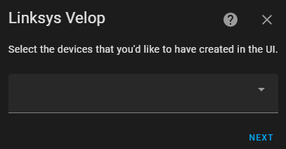
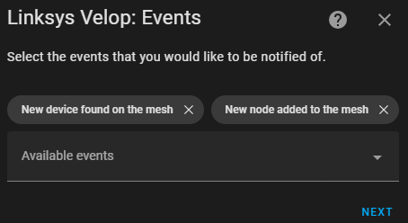

[![GitHub Release][badge_github_release_version]][github_release_link]
![GitHub Downloads (latest release)][badge_github_release_downloads]
[![GitHub Pre-release][badge_github_prerelease_version]][github_prerelease_link]
![GitHub Downloads (pre-release)][badge_github_prerelease_downloads]

# Linksys Velop

Home Assistant integration for the Linksys Velop Wi-Fi system.

## Table of Contents

* [Description](#description)
* [Installation](#installation)
* [Definitions](#definitions)
* [Entities Provided](#entities-provided)
  * [Binary Sensors](#binary-sensors)
  * [Buttons](#buttons)
  * [Device Trackers](#device-trackers)
  * [Event](#event)
  * [Select](#select)
  * [Sensors](#sensors)
  * [Switches](#switches)
* [Services](#services)
* [Repairs](#repairs)
* [Setup](#setup)
* [Configurable Options](#configurable-options)
  * [Timers](#timers)
  * [Device Trackers](#device-trackers-1)
  * [UI Devices](#ui-devices)
  * [Events](#events)
  * [Advanced Options](#advanced-options)
* [Troubleshooting](#troubleshooting)
  * [Debug Logging](#debug-logging)
  * [Diagnostics Integration](#diagnostics-integration)

## Description

This custom component has been designed for Home Assistant and enables access
to the functions that would be useful (and probably some that aren't) in the
Home Assistant environment.

## Installation

The integration can be installed using [HACS](https://hacs.xyz/).  The
integrations is not available in the default repositories, so you will need to
add the URL of this repository as a custom repository to HACS (see
[here](https://hacs.xyz/docs/faq/custom_repositories)).

Alternatively you can use the button below.

[](https://my.home-assistant.io/redirect/hacs_repository/?owner=uvjim&repository=linksys_velop&category=Integration)

## Definitions

__Mesh__: the mesh is the network itself and refers to anything that is not
attributed to a single node or device in the network.

__Node__: a node is a device that helps to form the mesh.

__Device__: a device is an endpoint that connects to the mesh network. Think of
these as the endpoint devices, such as a laptop, phone or tablet.

## Entities Provided

All device entities are only available if the [UI Device](#ui-devices) is
enabled.

Entities are only available if the required capability for that data is available
on the Mesh.  For example, if the Mesh does not support the storage JNAP actions
then the entities detailing storage partitions etc. will not be available.

### Binary Sensors

| Location | Name | Enabled by default | Additional Information | Comments |
|---|---|:---:|---|---|
| Device | Blocked Times | ✔️ | Times of the week that are blocked | |
| Device | Guest Network | ✔️ | | |
| Device | Reserved IP | ✔️ | | |
| Device | Status | ✔️ | | |
| Mesh | Channel Scanning | ✖️ | | |
| Mesh | Client Steering | ✖️ | | |
| Mesh | DHCP Server | ✖️ | | |
| Mesh | Express Forwarding | ✖️ | | |
| Mesh | HomeKit Integration Paired | ✖️ | | |
| Mesh | MAC Filtering | ✖️ | The mode and list of MAC addresses being filtered | |
| Mesh | Node Steering | ✖️ | | |
| Mesh | SIP | ✖️ | | |
| Mesh | Speedtest Status | ✖️ | | |
| Mesh | UPnP Allow Users to Configure | ✖️ | | |
| Mesh | UPnP Allow Users to Disable Internet | ✖️ | | |
| Mesh | WAN Status | ✔️ | IP, DNS and MAC | |
| Node | Status | ✔️ | Reservation, guest network, IP and MAC | |

### Buttons

| Location | Name | Enabled by default | Comments |
|---|---|:---:|---|
| Device | Delete | ✔️ | |
| Mesh | Check for Updates | ✔️ | |
| Mesh | Reboot the Whole Mesh | ✖️ | See [Configurable Options -> Advanced Options](#advanced-options) |
| Mesh | Start Channel Scan | ✖️ | Adjusts the interval for channel scanning data collection to 40s |
| Mesh | Start Speedtest | ✖️ | Adjusts the interval for speedtest data collection to 1s |
| Node | Reboot | ✔️ | |

>
> __N.B.__ There is deliberately no button provided to restart the Primary node
by default.
Restarting the Primary node will cause all nodes in the Mesh to reboot and
I consider this to be quite a destructive action. There is no confirmation in
the HASS UI when a button is pressed so there is no time to warn anyone. If
you'd like to reboot the Primary you node you must use the
[service](#services) with the `is_primary` flag provided, or the `Mesh: Reboot
the Whole Mesh` button.

### Device Trackers

These are selectable and are presented as part of the configuration at both
install time and from reconfiguring the integration.

Device trackers should be enabled by default and will be seen as entities of the
mesh. This is achieved by adding the MAC address to the known connections for the
Mesh device. You will see these in the HASS UI. When the tracker is removed, the
MAC is also removed from the Mesh device.

### Event

This entity provides access to data for the events selected in the configuration.
Available events are: -

| Event | Triggered | Comments |
|---|---|--|
| Mesh rebooted | When the Mesh data collection receives a response | This is the first response after the back off period |
| Mesh rebooting | When either the service or button is used to reboot the Mesh | The Mesh is flagged as rebooting and will then back off carrying out updates for 30s |
| New device found | When the integration carries out its normal polling period and a device with a new unique ID is found | The uniqued ID for comparison is the one provided by Linksys |
| New node found | When the integration carries out its normal polling period and a node with a new unique ID is found | The uniqued ID for comparison is the one provided by Linksys |

### Select

| Location | Name | Enabled by default | Primary value | Additional Information | Comments |
|---|---|:---:|---|---|---|
| Device | Devices | ✔️ | Selected device to show in the UI | Allows selecting of a device to show the information for the placeholder device | Only available if [temporary device](#advanced-options) is enabled |

### Sensors

| Location | Name | Enabled by default | Primary value | Additional Information | Comments |
|---|---|:---:|---|---|---|
| Device | Blocked sites | ✔️ | Count of blocked sites | List of blocked sites | |
| Device | Description | ✔️ | | | |
| Device | Friendly Signal Strength | ✔️ | | | |
| Device | ID | ✔️ | Unique ID as assigned by Linksys | | |
| Device | IP | ✔️ | | | |
| Device | IPv6 | ✔️ | | | |
| Device | MAC | ✔️ | | | |
| Device | Manufacturer | ✔️ | | | |
| Device | Model | ✔️ | | | |
| Device | Name | ✔️ | | | |
| Device | Operating system | ✔️ | | | |
| Device | Parent | ✔️ | | | |
| Device | Serial | ✔️ | | | |
| Device | Signal strength | ✔️ | RSSI value | | |
| Device | UI type | ✔️ | | | The `entity_picture` attribute will be set if `node_images` are configured, see [here](#advanced-options) |
| Mesh | Available Storage | ✖️ | Count of partitions available | List of the available partitions including: IP, label, available Kb, used Kb, used %age and last checked time | |
| Mesh | DHCP Reservations | ✖️ | Count of DHCP reservations | List of DHCP reservations | |
| Mesh | Offline Devices | ✔️ | Count of offline devices | List of offline device names and unique ID | |
| Mesh | Online Devices | ✔️ | Count of online devices | List of online device names, unique ID, IP, connection type and if they're on the guest network | |
| Mesh | Guest Devices | ✔️ | Count of guest devices | List of guest devices | List of online device names, unique ID, IP, connection type |
| Mesh | Speedtest Download Bandwidth | ✖️ | | | |
| Mesh | Speedtest Last Run | ✖️ | Timestamp when a Speedtest was last executed | | |
| Mesh | Speedtest Latency | ✖️ | | | |
| Mesh | Speedtest Progress | ✖️ | Textual representation of the current stage in the Speetest execution | | |
| Mesh | Speedtest Result | ✖️ | | | |
| Mesh | Speedtest Upload Bandwidth | ✖️ | | | |
| Mesh | WAN IP | ✔️ | | | |
| Node | Backhaul Friendly Strength | ✔️ | | | only available if using a wirless backhaul and is a secondary node |
| Node | Backhaul Last Checked | ✖️ | Timestamp of when the backhaul connection was last checked | | only available if a secondary node |
| Node | Backhaul Signal Strength | ✔️ | RSSI value | | only available if using a wirless backhaul and is a secondary node |
| Node | Backhaul Speed | ✔️ | | | only available if a secondary node |
| Node | Backhaul Type | ✔️ | Wired/Wireless| | only available if a secondary node |
| Node | Connected Devices | ✔️ | Count of connected devices | List of connected device names, unique ID, IP, connection type and if they're on the guest network | |
| Node | Last Update Check | ✖️ | Timestamp when the last check for a firmmware update was made | | |
| Node | Model | ✔️ | | | The `entity_picture` attribute will be set if `node_images` are configured, see [here](#advanced-options) |
| Node | Parent Name | ✔️ | | IP address of the parent | only available if a secondary node |
| Node | Serial | ✔️ | | | |
| Node | Type | ✔️ | Primary/Secondary | | |

### Switches

| Location | Name | Enabled by default | Additional Information | Comments |
|---|---|:---:|---|---|
| Device | Internet Access | ✔️ | | |
| Mesh | Guest Wi-Fi | ✔️ | List of guest networks including: SSID and band | |
| Mesh | HomeKit Integration | ✔️ | | |
| Mesh | Parental Control | ✔️ | List of objects defining the devices, blocked times and blocked sites | |
| Mesh | UPnP | ✔️ | | Only controls the state of the UPnP not the sub-components of UPnP, these are only binary sensors |
| Mesh | WPS | ✔️ | | |

### Update

| Location | Name | Enabled by default | Comments |
|---|---|:---:|---|
| Node | Update | ✔️ | |

## Services

The following services are available. Each service is described in metadata
so paramters are described in the Home Assistant Services page.

* Control Internet Access for a Device - allow/block access to the Internet
  for a device.
* Delete Device - delete a device from the Mesh device list.
* Reboot Node - reboot the given node.
* Rename Device - rename the given device in the Mesh device list.
* Set Device Parental Controls - set the times a device is blocked from using
  the Internet.

All services require that you select the Mesh device that the request should be
directed to. Other requirements by the services should be self-explanatory.

> __&ast;__ these are considered long-running tasks. When the binary sensors
  spot these tasks are running an additional timer is set up that polls at
  intervals to get updates and updates the relevant attributes for that
  sensor.
>
> __^__ these are deprecated services. A warning will be displayed in the HASS
  log when they are used. They are subject to removal at any time.

## Repairs

| Reason | Trigger | Resolution | Comments |
|---|---|---|---|
| Missing device tracker | Raised when the device, used for device tracking, no longer appears on the Mesh | Deletes the device tracker entity | This is based on the unique ID supplied by Linksys. If the device is still on the Mesh, and only its unique ID has changed, you should reconfigure the integration to use the device as a tracker again |
| Missing node | Raised when the given node no longer appears on the Mesh | Deletes the node device | This is based on the unique ID supplied by Linksys. If the node is still on the Mesh, and only its unique ID has changed, you should carry out the resolution and reload the integration |
| Missing UI device | Raised when the device, selected to be shown in the UI, no longer appears on the Mesh | Deletes the UI device | This is based on the unique ID supplied by Linksys. If the device is still on the Mesh, and only its unique ID has changed, you should reconfigure the integration to use the device as a tracker again |

## Setup

When setting up the integration you will be asked for the following information.


* `Primary node address`: must be the node classed as the primary node
* `Password`: the password you would use to log in to the router. This may
  not be the same as the password for the application or web UI if you use
  the Linksys cloud service.


* `Scan Interval`: the frequency of updates for the sensors, default `60s`
* `Device Tracker Interval`: the frequency of updates for the device
  trackers, default `10s`
* `Consider Home Period`: the time to wait before considering a device away
  after it notifies of becoming disconnected, default `180s`
* `Response Timeout`: the number of seconds to wait for a response from
  an individual request to the API, default `10s`


* `Available devices`: a multi-select list of the devices found on the mesh.

On successful set up the following screen will be seen detailing the Mesh
device and the individual nodes found in the mesh.


## Configurable Options

It is possible to configure the following options for the integration.

### Timers


* `Scan Interval`: the frequency of updates for the sensors, default `60s`
* `Device Tracker Interval`: the frequency of updates for the device
  trackers, default `10s`
* `Consider Home Period`: the time to wait before considering a device away
  after it notifies of becoming disconnected, default `180s`
* `Response Timeout`: the number of seconds to wait for a response from
  an individual request to the API, default `10s`

### Device Trackers


* `Available devices`: a multi-select list of the devices found on the mesh.

### UI Devices

A UI device is one which is available on the mesh and you would like to have
further information available in Home Assistant. IT could be that you want to
create automations based on a device signal strength, parent node or state
(without using a `device tracker`).



* `Available devices`: a multi-select list of the devices found on the mesh.
  This list excludes any device which doesn't have a name - typically
  displayed in the official interfaces as `Network Device`

### Events

The events selected here will be raised with the `event` entity.



### Advanced Options

__This section is only available if "Advanced Mode" is enabled for the current__
__user. See [here](https://www.home-assistant.io/blog/2019/07/17/release-96/#advanced-mode).__


* `Velop image path`: the path to the folder location containing the images to
  use for integration purposes. This is currently used for to set the entity
  picture for various entities. It relies on the `http` integration from HASS,
  details of which can be found
  [here](https://www.home-assistant.io/integrations/http), and more specifically
  [here](https://www.home-assistant.io/integrations/http#hosting-files) for the
  path to place the files in.
* `Use a temporary device for select entity details`: creates a placeholder
  device that will be populated with the details of the device selected in
  the [select](#select) entity. The `select` entity will no longer have the
  details populated to its attributes.
* `Allow rebooting the Mesh`: creates a button on the Mesh entity that allows
  rebooting the whole mesh.

## Troubleshooting

### Debug Logging

> This way of logging is most useful if there is an intermitent problem as it
will continue logging until it is disabled again.

Debug logging can be enabled in Home Assistant using the `logger`
integration see [here](https://www.home-assistant.io/integrations/logger/).

```yaml
logger:
  default: warning
  logs:
    custom_components.linksys_velop: debug
    pyvelop: debug
```

### Diagnostics Integration

The highlighted area in the image below shows where the link for downloading
diagnostics can be found.


Example output: -

* [Device](examples/device_diagnostics.json)
* [Configuration Entry and Mesh](examples/config_entry_and_mesh_diagnostics.json)

[badge_github_release_version]: https://img.shields.io/github/v/release/uvjim/linksys_velop?display_name=release&style=for-the-badge&logoSize=auto
[badge_github_release_downloads]: https://img.shields.io/github/downloads/uvjim/linksys_velop/latest/total?style=for-the-badge&label=downloads%40release
[badge_github_prerelease_version]: https://img.shields.io/github/v/release/uvjim/linksys_velop?include_prereleases&display_name=release&style=for-the-badge&logoSize=auto&label=pre-release
[badge_github_prerelease_downloads]: https://img.shields.io/github/downloads-pre/uvjim/linksys_velop/latest/total?style=for-the-badge&label=downloads%40pre-release
[github_release_link]: https://github.com/uvjim/linksys_velop/releases/latest
[github_prerelease_link]: https://github.com/uvjim/linksys_velop/releases
