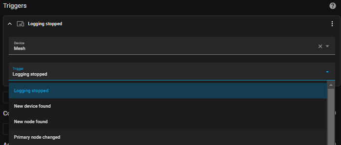
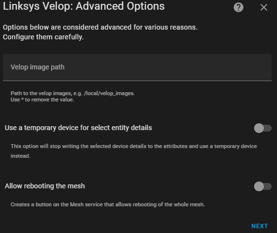

# Linksys Velop

Home Assistant integration for the Linksys Velop Wi-Fi system.

## Table of Contents

* [Description](#description)
  * [Installation](#installation)
  * [Definitions](#definitions)
  * [Entities Provided](#entities-provided)
    * [Binary Sensors](#binary-sensors)
    * [Buttons](#buttons)
    * [Device Trackers](#device-trackers)
    * [Select](#select)
    * [Sensors](#sensors)
    * [Switches](#switches)
    * [Update](#update-only-if-hass--202240)
  * [Events Fired](#events-fired)
    * [logging_stopped](#logging_stopped)
    * [new_device](#new_device)
    * [new_node](#new_node)
    * [new_primary_node](#new_primary_node)
  * [Device Triggers](#device-triggers)
  * [Services](#services)
* [Setup](#setup)
* [Configurable Options](#configurable-options)
  * [Timers](#timers)
  * [Device Trackers](#device-trackers-1)
  * [Advanced Options](#advanced-options)
  * [Logging](#logging)
* [Troubleshooting](#troubleshooting)
  * [Debug Logging](#debug-logging)
  * [Diagnostics Integration](#diagnostics-integration)
* [Example Automations](#example-automations)

## Description

This custom component has been designed to for Home Assistant and enables
access to the functions that would be useful in the Home Assistant environment.

### Installation

The integration can be installed using [HACS](https://hacs.xyz/).  The
integrations is not available in the default repositories, so will need to add
a the URL of this repository as a custom repository to HACS (see
[here](https://hacs.xyz/docs/faq/custom_repositories)).

### Definitions

* _Mesh_: the mesh is the network itself and refers to anything that is not
  attributed to a single node or device in  the network.
* _Node_: a node is a device that helps to form the mesh.
* _Device_: a device is an endpoint that connects to the mesh network. Think
  of these as the endpoint devices, such as a laptop, phone or tablet.

### Entities Provided

Where applicable the sub-items in the list detail the additional attributes
available.

#### Binary Sensors

* Mesh: Channel Scanning
* Mesh: Client Steering _(disabled by default)_
* Mesh: DHCP Server _(disabled by default)_
* Mesh: Express Forwarding _(disabled by default)_
* Mesh: HomeKit Integration _(disabled by default)_
* Mesh: HomeKit Integration Paired _(disabled by default)_
* Mesh: MAC Filtering _(disabled by default)_
  * mode, address list
* Mesh: Node Steering _(disabled by default)_
* Mesh: SIP _(disabled by default)_
* Mesh: Speedtest state
  * current stage of the Speedtest, e.g. Detecting server, Checking latency
* Mesh: UPnP _(disabled by default)_
* Mesh: UPnP Allow Users to Configure _(disabled by default)_
* Mesh: UPnP Allow Users to Disable Internet _(disabled by default)_
* Mesh: WAN Status
  * IP, DNS, MAC
* Mesh: WPS _(disabled by default)_
* Node: Status
  * IP, MAC, guest network
* Node: Update Available (only if HASS < 2022.4.0)

#### Buttons

* Mesh: Check for Updates
* Mesh: Start Channel Scanning _(interval: 40s)_
* Mesh: Start Speedtest _(interval: 1s)_
* Node: Reboot

> **N.B.** Buttons with an in terval in brackets start a long running task.
  When they are pressed or the corresponding `binary_sensor` realises that the
  task is running a secondary timer is started, using the specified interval.
>
> **N.B.** There is deliberately no button provided to restart the Primary node.
  Restarting the Primary node will cause all nodes in the Mesh to reboot and
  I consider this to be quite a destructive action. There is no confirmation in
  the HASS UI when a button is pressed so there is no time to warn anyone. If
  you'd like to reboot the Primary you node you must use the
  [service](#services) with the `is_primary` flag provided.

#### Device Trackers

These are selectable and are presented as part of the configuration at both
install time and from reconfiguring the integration.

#### Select

* Mesh: Devices _(disabled by default)_
  * Once a device is selected the attributes will be updated to reflect the
    following: connected adapters, description, manufacturer, model, name,
    operating_system, parent name, serial, status and unique_id

#### Sensors

* Mesh: DHCP Reservations _(disabled by default)_
  * list of DHCP reservations on the mesh
* Mesh: Number of Offline Devices
  * list of device objects containing names and unique ID of devices that are
    offline
* Mesh: Number of Online Devices
  * list of device objects containing names, unique IDs, IP addresses, adapter
    types and guest network state for the online devices
* Mesh: Number of Guest Devices _(disabled by default)_
  * list of device names, IP addresses, adapter types etc
* Mesh: Date of Latest Speedtest
  * Exit code, Latency, Download/Upload bandwidth, Result ID
* Mesh: Number of Available Storage Partitions _(disabled by default)_
  * list of the available partitions including the following information: IP,
    label, available Kb, used Kb, used %age and last checked time
* Mesh: WAN IP
* Node: Number of Connected Devices
  * list of names, IP addresses, type of connection and guest network state for
    the connected devices
* Node: Backhaul Signal Strength
  * textual representation of RSSI
* Node: Backhaul Last Checked _(disabled by default)_
* Node: Backhaul Speed
* Node: Backhaul Type
* Node: Current Firmware Version (only if HASS < 2022.4.0)
* Node: Image _(disabled by default. Only available if `node_images` are
  configured, see [here](#advanced-options))_
* Node: Last Update Check _(disabled by default)_
* Node: Model Number _(The `entity_picture` attribute will be set if
  `node_images` are configured, see [here](#advanced-options))_
* Node: Newest Firmware Version (only if HASS < 2022.4.0)
* Node: Parent Name
  * IP address of the parent
* Node: Serial Number
* Node: Type of Node, e.g. Primary Secondary

#### Switches

* Mesh: Guest Wi-Fi state
  * list of guest networks available
* Mesh: Parental Control state
  * list of the rules being applied

#### Update (only if HASS > 2022.4.0)

* Node: Firmware update available.
  * includes current and latest firmware versions

### Events Fired

The integration fires an event with type `linksys_velop_event`. Withing the data
object there is a `subtype` value which denotes the reason for the event. This
section shows the available subtypes.

#### `logging_stopped`

This event is fired when logging was turned on in the configurable options
(see [here](#logging)) and has stopped.

The event looks as follows: -

```yaml
event_type: linksys_velop_event
data:
  name: 192.168.1.254
  subtype: logging_stopped
origin: LOCAL
time_fired: "2022-10-05T14:06:34.120984+00:00"
context:
  id: 01GEM7GDM8VE5Q4S27P3WPNTX4
  parent_id: null
  user_id: null
```

#### `new_device`

This event is fired when a brand-new device appears on the Mesh. A device is
considered new if it presents a device ID (determined by the Velop) that was
not seen at the last poll period. This means that it will not fire for
devices that change from online to offline and vice-versa.

The event is fired for each new device that is discovered. The data is as
the Velop mesh sees it, i.e. there is no magic by the integration to
establish the manufacturer, model, operating system or serial.

> **N.B.** The name will default to `Network Device` if there is no name
established by the Velop or assigned by the user.

The event looks as follows: -

```yaml
event_type: linksys_velop_event
data:
  connected_adapters: []
  description: null
  manufacturer: null
  model: null
  name: Network Device
  operating_system: null
  parent_name: null
  serial: null
  status: false
  unique_id: e053a99e-f8b6-4061-b9d3-7a19a38ec079
  mesh_device_id: f31f325891bc59506bdf98a54e23fcdd
  subtype: new_device
origin: LOCAL
time_fired: "2022-10-05T13:47:38.933813+00:00"
context:
  id: 01GEM6DS1NND3PG936RFBGTGFJ
  parent_id: null
  user_id: null
```

#### `new_node`

This event is fired when a new node is found on the Mesh. A node is
considered new if it is not currently configured in HASS. It may not be
configured for a couple of reasons: the device was deleted from the UI, or
you've added a new node to your Mesh.

The event is fired for each new node that is discovered.

The event looks as follows: -

```yaml
event_type: linksys_velop_event
data:
  backhaul: {}
  connected_adapters: []
  model: MX42
  name: Utility
  parent_name: null
  serial: 123456789
  status: false
  unique_id: 80236f06-e622-faec-9410-e89f80603b3d
  mesh_device_id: f31f325891bc59506bdf98a54e23fcdd
  subtype: new_node
origin: LOCAL
time_fired: "2022-10-05T13:43:17.135224+00:00"
context:
  id: 01GEM65SCF8BVK3BEVFHXWS5F2
  parent_id: null
  user_id: null
```

#### `new_primary_node`

This event is fired when a new primary node is detected. The check for this
is based on the serial number and is currently only found as part of SSDP
discovery. If the serial numbers do not match, this event is fired and the
unique_id of the integration instance is update.

This should stop the mesh being discovered again by SSDP when the primary
node is changed.

```yaml
event_type: linksys_velop_event
data:
  host: 192.168.1.254
  model: "velop ax4200 wifi 6 system"
  serial: 1234567890
  subtype: new_primary_node
origin: LOCAL
time_fired: "2022-10-05T13:43:17.135224+00:00"
context:
  id: 01GEM65SCF8BVK3BEVFHXWS5F2
  parent_id: null
  user_id: null
```

### Device Triggers

All events are available in automations as device triggers on the Mesh device,
as per the following screenshot.



### Services

The following services are available. Each service is described in metadata
so paramters are described in the Home Assistant Services page.

* Check for Updates ^ - check if there are firmware updates for the nodes.
* Control Internet Access for a Device - allow/block access to the Internet
  for a device.
* Delete Device - delete a device from the Mesh device list.
* Execute Speedtest &ast;^ - carry out a Speedtest from the Primary node.
* Reboot Node - reboot the given node.
* Rename Device - rename the given device in the Mesh device list.

All services require that you select the Mesh device that the request should be
directed to. Other requirements by the services should be self-explanatory.

> **&ast;** these are considered long-running tasks. When the binary sensors
  spot these tasks are running an additional timer is set up that polls at
  intervals to get updates and updates the relevant attributes for that
  sensor.
>
> **^** these are deprecated services. A warning will be displayed in the HASS
  log when they are used. They are subject to removal at any time.

## Setup

When setting up the integration you will be asked for the following information.


* `Primary node address`: must be the node classed as the primary node
* `Password`: the password you would use to log in to the router. This may
  not be the same as the password for the application or web UI if you use
  the Linksys cloud service.

On successful set up the following screen will be seen detailing the Mesh
device and the individual nodes found in the mesh.


## Configurable Options

It is possible to configure the following options for the integration.

### Timers


* `Scan Interval`: the frequency of updates for the sensors, default `30s`
* `Device Tracker Interval`: the frequency of updates for the device
  trackers, default `10s`
* `Consider Home Period`: the time to wait before considering a device away
  after it notifies of becoming disconnected, default `180s`
* `Response Timeout`: the number of seconds to wait for a response from
  an individual request to the API

### Device Trackers


* `Available devices`: a multi-select list of the devices found on the mesh.
  This list excludes any device which doesn't have a name - typically
  displayed in the official interfaces as `Network Device`

### Advanced Options

**This section is only available if "Advanced Mode" is enabled for the current**
**user. See**
**[here](https://www.home-assistant.io/blog/2019/07/17/release-96/#advanced-mode).**



* `Node image path`: the path to the folder location containing the images to
  use for nodes. This is currently used for to set the entity picture for the
  `update` entity.  This relies on the `http` integration from HASS, details of
  which can be found
  [here](https://www.home-assistant.io/integrations/http), and more specifically
  [here](https://www.home-assistant.io/integrations/http#hosting-files) for the
  path to place the files in.

### Logging


* `Include the serial number in debug logs`: setting this will make the serial
number of the primary node appear in the debug logs. This will be useful if
there a multiple instances of the integration configured. _(defaults to off)_
* `Include query responses in logs`: setting this will cause the debug logs to
include the responses to the queries. This could drastically increase the size
of your logs depending on the number of devices you have connected to the mesh.

  > **N.B.** there is no redaction on the responses as much of the response will
  be required for troubleshooting. Using [diagnostics](#diagnostics-integration)
  a pre-processed and redacted version can be downloaded for the mesh or a node.
  _(defaults to off)_
* `Logging mode` - this setting has no effect if logging for the integration is
configured in `configuration.yaml` and is only available if the
[`logger`](https://www.home-assistant.io/integrations/logger/) integration is
enabled in `configuration.yaml`.
  * `off`: disable debug logging
  * `Single poll`: only enable debug logging for a single poll requesting
  information from the Mesh.

## Troubleshooting

### Debug Logging

> This way of logging is most useful if there is an intermitent problem as it
will continue logging until it is disabled again. If your intention is only to
log a single request because the issue is repeatable then see [here](#logging).

Debug logging can be enabled in Home Assistant using the `logger`
integration see [here](https://www.home-assistant.io/integrations/logger/).

```yaml
logger:
  default: warning
  logs:
    custom_components.linksys_velop: debug
    pyvelop: debug
```

### Diagnostics Integration

Starting with Home Assistant 2022.2 a new diagnostics integration can be
used to provide troubleshooting for integrations. This integration supports that
as of version `2021.1.3`.

The highlighted area in the image below shows where the link for downloading
diagnostics can be found.


Example output: -

* [Device](examples/device_diagnostics.json)
* [Configuration Entry and Mesh](examples/config_entry_and_mesh_diagnostics.json)

# Example Automations

Below are some example automations.

**I'm aware some of these could be more generic or even done in a better way but
these are for example purposes only.**

<details>
  <summary>Notify when a node goes offline or comes online</summary>

  ```yaml
  alias: 'Notify: Velop node online/offline'
  description: ''
  trigger:
    - platform: state
      entity_id: binary_sensor.velop_utility_status
      id: Node Online
      from: 'off'
      to: 'on'
    - platform: state
      entity_id: binary_sensor.velop_utility_status
      id: Node Offline
      from: 'on'
      to: 'off'
  condition: []
  action:
    - choose:
        - conditions:
            - condition: trigger
              id: Node Online
          sequence:
            - service: persistent_notification.create
              data:
                message: Node is online
        - conditions:
            - condition: trigger
              id: Node Offline
          sequence:
            - service: persistent_notification.create
              data:
                message: Node is offline
      default: []
  mode: single
  ```

</details>

<details>
  <summary>Notify on events</summary>

```yaml
alias: "Notify: Velop Information"
description: ""
trigger:
  - platform: event
    event_type: linksys_velop_event
    event_data:
      subtype: new_device
    id: Device Found
  - platform: event
    event_type: linksys_velop_event
    event_data:
      subtype: new_node
    id: Node Found
  - platform: event
    event_type: linksys_velop_event
    event_data:
      subtype: new_primary_node
    id: Primary Node Changed
  - platform: event
    event_type: linksys_velop_event
    event_data:
      subtype: logging_stopped
    id: Logging Stopped
condition: []
action:
  - variables:
      title_prefix: "Linksys Velop - "
  - if:
      - condition: template
        value_template: "{{ trigger.id in [\"Logging Stopped\"] }}"
    then:
      - variables:
          notification_id: logging_stopped
          message: Logging has stopped for {{ trigger.event.data.get('name') }}
      - service: persistent_notification.create
        data:
          notification_id: "{{ notification_id }}"
          title: "{{ title_prefix }}{{ trigger.id }}"
          message: "{{ message }}"
    else:
      - variables:
          notification_id: >-
            {{ trigger.event.event_type }}_{{
            trigger.event.data.get('unique_id') or
            trigger.event.data.get('serial') }}
          message: >-
            
              ## {{ trigger.event.data.name }}
            

            |   |   |   |

            |---|---|---| 

            |Mesh:|&emsp;|{{ device_attr(trigger.event.data.mesh_device_id,
            'name_by_user') or device_attr(trigger.event.data.mesh_device_id,
            'name') }}|  

            |Parent:|&emsp;|{{ trigger.event.data.parent_name }}|  

            |Host:|&emsp;|{{ trigger.event.data.host }}|  

            |Guest:|&emsp;|{{ 'Yes' if
            trigger.event.data.connected_adapters[0].get('guest_network', False)
            is eq true else 'No' }}|

            |IP:|&emsp;|{{ trigger.event.data.connected_adapters[0].get('ip',
            'N/A') }}|

            |MAC:|&emsp;|{{ trigger.event.data.connected_adapters[0].get('mac',
            'N/A') }}|  

            |Description:|&emsp;|{{ trigger.event.data.description }}|  

            |Manufacturer:|&emsp;|{{ trigger.event.data.manufacturer }}|  

            |Model:|&emsp;|{{ trigger.event.data.model }}|  

            |Serial:|&emsp;|{{ trigger.event.data.serial }}|  

            |Operating System:|&emsp;|{{ trigger.event.data.operating_system }}|
            
      - service: persistent_notification.create
        data:
          notification_id: "{{ notification_id }}"
          title: "{{ title_prefix }}{{ trigger.id }}"
          message: "{{ message }}"
mode: parallel
```

</details>
